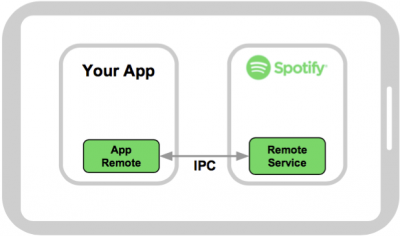

# Spotify App Remote SDK (Android)

## Beta Release Information
We're releasing this SDK early to gain feedback from the developer community about the future of 
our Android SDKs. Please file feedback about missing issues or bugs over at our [issue tracker](https://github.com/spotify/android-app-remote-sdk/issues), 
making sure you search for existing issues and adding your voice to those rather than duplicating.

[Open bug tickets](https://github.com/spotify/android-app-remote-sdk/labels/bug) | [Open feature requests](https://github.com/spotify/android-app-remote-sdk/labels/feature%20request) | [All](https://github.com/spotify/android-app-remote-sdk/issues)

## The Spotify App Remote SDK

The Spotify App Remote SDK allows your application to interact with the Spotify app running in the
background as a service. The capabilities of this SDK include getting metadata for the currently
playing track and context, issuing basic playback commands and initiating playback of tracks.

The Spotify App Remote SDK is a set of lightweight objects that connect with the Spotify app and let you
 control it while all the heavy lifting of playback is offloaded to the Spotify app itself.
 The Spotify app takes care of playback, networking, offline caching and OS music integration,
 leaving you to focus on your user experience. Also, with the Spotify App Remote SDK, moving from your app
 to the Spotify app and vice versa is a streamlined experience where playback and metadata always
 stay in sync.
 
 #### Key Features
 
 * Lightweight library < 300k. No native code or processor architecture dependencies
 * Playback always in sync with Spotify app
 * Processing of playback and caching as well as network traffic is accounted for by the Spotify app
 * Handles system integration such as audio focus, lockscreen controls and incoming calls
 * Automatically handles track relinking for different regions
 * Works offline and online and does not require Web API calls to get metadata for PlayerState
 
 **Note**: While certain playback controls work offline and playback can happen offline for offlined
  content, apps cannot connect and start communicating with Spotify unless there is an internet connection

## Getting started

* Download the library from the `app-remote-lib` directory
* Follow the [Beginner's Tutorial](https://beta.developer.spotify.com/documentation/android-app-remote/quick-start/). The tutorial is designed to help you set up your build environment and 
get started with the Spotify App Remote SDK (Android). It leads you through the creation of a 
simple app that connects to the Spotify app, plays a playlist and subscribes to PlayerState.
* Have a look at the demo app in the `demo` directory. The demo app includes full source code and 
example uses of the APIs available in the Spotify App Remote SDK (Android) to help you getting started.

## SDK Components Overview
The download package includes comprehensive Javadoc documentation of all API classes in the `docs`
folder.

#### Models
Some of the models in the Spotify App Remote SDK are
* Album
* Artist
* Track
* PlayerState
* PlayerContext

#### The PlayerState
It could answer the following questions

* what track is being played now?
* is the player playing/paused?
* what is current playback position?
* is the track saved to the user's library?

#### The PlayerContext
Get metadata like the title of the current context that is playing - such as an album or a playlist.

#### SpotifyAppRemote
Think of it as an interface to the Spotify app that
lets you control some aspects of the app, query for the data, and subscribe to the events.
It exposes set of API like *PlayerApi* and *ImagesApi*.
You should use it as en entry point to all your interactions with the Spotify app.

#### Connector
Is a component that lets you receive an instance of SpotifyAppRemote.

#### PlayerApi
Send playback related commands such as:

* play content by URI
* resume/pause playback
* shuffle playback

You can also subscribe to the following events:

* PlayerState updates
* PlayerContext updates

**Note**: A **Spotify Premium** account is required to play a single track uri. You should make a 
call to the UserApi to get the on-demand capabilities of a user before attempting to play a single track uri.

#### UserApi
Get user-related data and perform actions such as:

* user capabilities - can this user play music on demand?
* add/remove content in a user's library

#### ImagesApi
Use it to download cover arts by URI

#### ContentApi
Get a list of content

#### ConnectApi
Control on what device the Spotify app should be playing music

## Authentication, Authorization and Scopes

In order to use the Spotify App Remote SDK, your application will need to get user's permission to control playback
remotely first. This can be done in two ways:

1. By using Single Sign-On library. To do that you'll need to include the
[Android Authentication Library](https://beta.developer.spotify.com/documentation/android-sdk/quick-start/#install-the-spotify-android-sdk) in your project
 and request `app-remote-control` scope. This approach is useful if you need to request more scopes
 or an access token for other purposes, for example to communicate with
 [Spotify Web API](https://beta.developer.spotify.com/documentation/web-api/). 
 Our [Android SDK Authentication Guide](https://beta.developer.spotify.com/documentation/android-sdk/quick-start/#authenticate-the-user)
 provides instructions and examples for both methods.
2. Use built-in authorization mechanism in Spotify App Remote (Android). To do that you'll need to request to show
authorization view when connecting to Spotify. The library will automatically request the
`app-remote-control` scope and show the auth view if user hasn't agreed to it yet. Currently you
won't be able to get the token back from the Remote SDK. It's also not possible to request
additional scopes. The Beginner's Tutorial contains an example on
how to use this method.

**Note:** apps cannot be authorized or initiate a connection to start communicating with Spotify unless there is an internet connection.

**Note:** The Spotify Android app must be installed on the user's device in order for the Spotify App Remote SDK to work. Please see the ["Installing Spotify" section](https://beta.developer.spotify.com/documentation/general/guides/content-linking-guide/) of the Content Linking guide on how to direct users to download Spotify.

## Terms of Use

Note that by using Spotify developer tools, you accept our [Developer Terms of Use](https://beta.developer.spotify.com/terms/).

